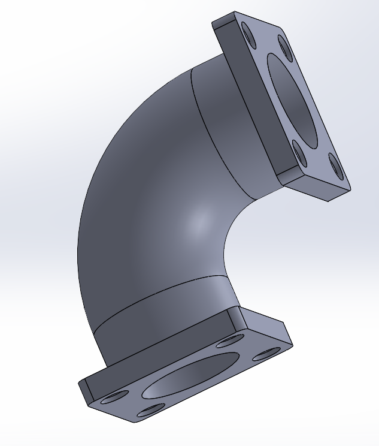

# CW Day 03 - Classwork 1

## 📋## 🚀 **Quick Access & Download**

<div align="center">

### 📥 **Download SOLIDWORKS File**
[](cw%2001%2C%20day%2003.SLDPRT)

**Direct File Access:** [🔧 `cw 01, day 03.SLDPRT`](cw%2001%2C%20day%2003.SLDPRT)

---

### 🎯 **Quick Navigation**
| 📁 **File Type** | 📂 **File Name** | 🔗 **Quick Access** |
|:---:|:---:|:---:|
| 🔧 **SOLIDWORKS** | `cw 01, day 03.SLDPRT` | [📥 **Download**](cw%2001%2C%20day%2003.SLDPRT) |
| 📸 **Screenshot 1** | `Screenshot 2025-09-30 153412.png` | [🖼️ **View**](Screenshot%202025-09-30%20153412.png) |
| 📸 **Screenshot 2** | `Screenshot 2025-09-30 153619.png` | [🖼️ **View**](Screenshot%202025-09-30%20153619.png) |
| 📷 **Additional** | `file_2025-09-30_09.35.24.png` | [🖼️ **View**](file_2025-09-30_09.35.24.png) |
| 📚 **Reference** | `WhatsApp Image...67a9ddc1.jpg` | [🔍 **View**](WhatsApp%20Image%202025-09-27%20at%2012.23.38_67a9ddc1.jpg) |

</div>

## 📂 File Contents

### 🔧 SOLIDWORKS Files
- **`cw 01, day 03.SLDPRT`** - Main SOLIDWORKS part file for this assignment
  - 📥 **[Direct Download Link](cw%2001%2C%20day%2003.SLDPRT)**ject Overview
This folder contains the first classwork assignment from Day 03, including SOLIDWORKS part files, screenshots, and reference images.

## �️ Interactive Design Showcase

### 🎯 Design Development Screenshots
<details open>
<summary>📸 View Design Progress (Click to expand/collapse)</summary>

#### Design Screenshot 1

*Primary design view showing main features and geometry*

#### Design Screenshot 2

*Alternative perspective highlighting design details and functionality*

#### Additional Project Screenshot

*Supplementary screenshot capturing additional design elements*

</details>

### 📚 Reference Material
<details>
<summary>🔍 Click to view reference image</summary>


*Reference image provided for design guidance and specifications*

</details>

## �📂 File Contents

### 🔧 SOLIDWORKS Files
- **`cw 01, day 03.SLDPRT`** - Main SOLIDWORKS part file for this assignment

### 📸 Screenshots & Images
- **`Screenshot 2025-09-30 153412.png`** - Design screenshot 1
- **`Screenshot 2025-09-30 153619.png`** - Design screenshot 2  
- **`file_2025-09-30_09.35.24.png`** - Additional project screenshot
- **`WhatsApp Image 2025-09-27 at 12.23.38_67a9ddc1.jpg`** - Reference image

## 🎯 Project Details
- **Date Created:** September 27-30, 2025
- **Type:** Classwork Assignment
- **Day:** Day 03
- **Assignment:** CW 1

## 📋 File Structure
```
cw 1/
├── cw 01, day 03.SLDPRT          # Main SOLIDWORKS file
├── Screenshot 2025-09-30 153412.png  # Screenshot 1
├── Screenshot 2025-09-30 153619.png  # Screenshot 2
├── file_2025-09-30_09.35.24.png     # Additional screenshot
├── WhatsApp Image 2025-09-27...jpg   # Reference image
└── README.md                         # This file
```

## 🔍 Quick Preview
The screenshots show the progression and different views of the SOLIDWORKS design created for this classwork assignment.

## 📝 Notes
- All files created during Day 03 classwork session
- Multiple screenshots capture different stages/views of the design process
- Reference image provided for design guidance

---
*Last updated: September 30, 2025*