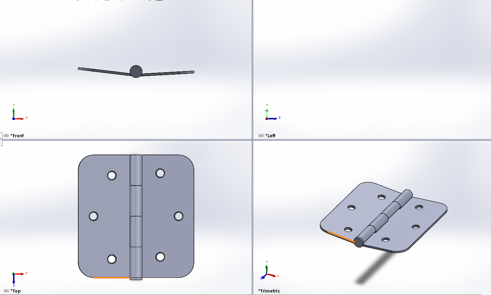

# CW 01 - Day 06

## Project Overview
This is a Class Work project featuring a 2-part mechanical assembly. The project includes detailed SOLIDWORKS files with proper constraints, relations, and technical specifications designed to enhance CAD modeling skills.

## Files Included
- **Assembly File**: [day 6 assembly.SLDASM](day 6 assembly.SLDASM)
- **Part File 1**: [cw 01 day 6.SLDPRT](cw 01 day 6.SLDPRT)
- **Part File 2**: [cw 01 day 6 part 2 pin.SLDPRT](cw 01 day 6 part 2 pin.SLDPRT)
- **Screenshot**: [Screenshot 2025-10-27 135102.png](Screenshot 2025-10-27 135102.png)

## Preview

## Download Instructions
1. Click on each file link above to download
2. Open the assembly file (day 6 assembly.SLDASM) in SOLIDWORKS
3. Ensure all part files are in the same folder
4. Check assembly constraints and relations

## Project Details
- **Day**: 6
- **Type**: Class Work
- **Project Number**: 1
- **Total Parts**: 2
- **Assembly File**: day 6 assembly.SLDASM
- **Upload Date**: 10/28/2025

## Technical Specifications
- **Assembly Format**: SOLIDWORKS Assembly (.SLDASM)
- **Part Format**: SOLIDWORKS Part (.SLDPRT)
- **Number of Components**: 2 parts
- **Preview Format**: .PNG image
- **Compatibility**: SOLIDWORKS 2020 or later
- **File Size**: 497.96 KB total

---
*This README was auto-generated by the SOLIDWORKS Upload System on 10/28/2025, 8:07:19 AM*