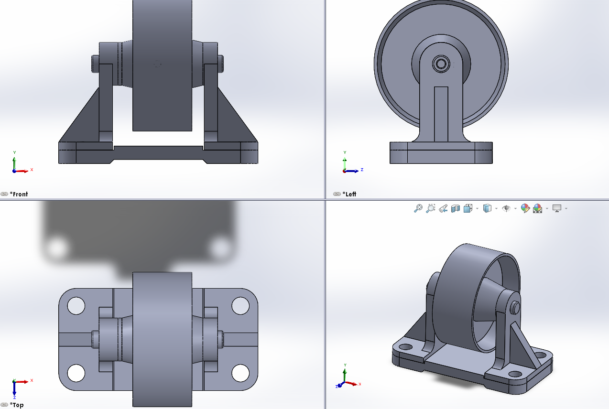

# CW 01 - Day 06

## Project Overview
This is a Class Work project featuring preview screenshot, documentation. The project includes SOLIDWORKS files designed to enhance CAD modeling skills with comprehensive documentation.

## Files Included
- **Screenshot**: [Screenshot 2025-10-27 140310.png](Screenshot 2025-10-27 140310.png)
- **Guide**: [HW 6_2.pdf](HW 6_2.pdf)

## Preview

## Download Instructions
1. Click on each file link above to download
2. Open the assembly file (*.SLDASM) in SOLIDWORKS
3. Ensure all part files are in the same folder
4. Check assembly constraints and relations

## Project Details
- **Day**: 6
- **Type**: Class Work
- **Project Number**: 1
- **Total Parts**: 0
- **Assembly File**: Not specified
- **Upload Date**: 10/28/2025

## Technical Specifications
- **Preview Format**: .PNG image
- **Compatibility**: SOLIDWORKS 2020 or later
- **File Size**: 866.71 KB total

---
*This README was auto-generated by the SOLIDWORKS Upload System on 10/28/2025, 10:10:26 AM*