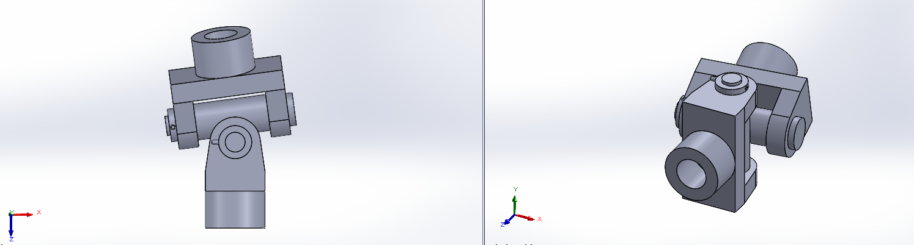

# CW 02 - Day 06

## Project Overview
This is a Class Work project featuring a 6-part mechanical assembly. The project includes detailed SOLIDWORKS files with proper constraints, relations, and technical specifications designed to enhance CAD modeling skills.

## Files Included
- **Assembly File**: [day 6 cw 2  assembly.SLDASM](day 6 cw 2  assembly.SLDASM)
- **Part File 1**: [cw 02 day 6 part 1 fork.SLDPRT](cw 02 day 6 part 1 fork.SLDPRT)
- **Part File 2**: [cw 02 day 6 part 2 pin.SLDPRT](cw 02 day 6 part 2 pin.SLDPRT)
- **Part File 3**: [cw 02 day 6 part 3 collar.SLDPRT](cw 02 day 6 part 3 collar.SLDPRT)
- **Part File 4**: [cw 02 day 6 part 4 tapper pin.SLDPRT](cw 02 day 6 part 4 tapper pin.SLDPRT)
- **Part File 5**: [cw 02 day 6 part 5 centre block.SLDPRT](cw 02 day 6 part 5 centre block.SLDPRT)
- **Part File 6**: [Part2.SLDPRT](Part2.SLDPRT)
- **Screenshot**: [Screenshot 2025-10-27 141129.png](Screenshot 2025-10-27 141129.png)

## Preview

## Download Instructions
1. Click on each file link above to download
2. Open the assembly file (day 6 cw 2  assembly.SLDASM) in SOLIDWORKS
3. Ensure all part files are in the same folder
4. Check assembly constraints and relations

## Project Details
- **Day**: 6
- **Type**: Class Work
- **Project Number**: 2
- **Total Parts**: 6
- **Assembly File**: day 6 cw 2  assembly.SLDASM
- **Upload Date**: 10/28/2025

## Technical Specifications
- **Assembly Format**: SOLIDWORKS Assembly (.SLDASM)
- **Part Format**: SOLIDWORKS Part (.SLDPRT)
- **Number of Components**: 6 parts
- **Preview Format**: .PNG image
- **Compatibility**: SOLIDWORKS 2020 or later
- **File Size**: 743.47 KB total

---
*This README was auto-generated by the SOLIDWORKS Upload System on 10/28/2025, 8:08:49 AM*