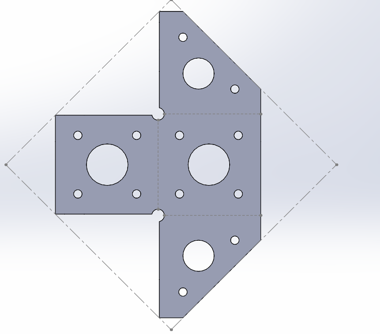

# CW 01 - Day 08

## Project Overview
This is a Class Work project featuring 3 parts, preview screenshot. The project includes SOLIDWORKS files designed to enhance CAD modeling skills.

## Files Included
- **Part File 1**: [cw 1.SLDPRT](cw 1.SLDPRT)
- **Part File 2**: [cw2.SLDPRT](cw2.SLDPRT)
- **Part File 3**: [cWW1.SLDPRT](cWW1.SLDPRT)
- **Screenshot**: [Screenshot 2025-10-28 100710.png](Screenshot 2025-10-28 100710.png)

## Preview

## Download Instructions
1. Click on each file link above to download
2. Open the assembly file (*.SLDASM) in SOLIDWORKS
3. Ensure all part files are in the same folder
4. Check assembly constraints and relations

## Project Details
- **Day**: 8
- **Type**: Class Work
- **Project Number**: 1
- **Total Parts**: 3
- **Assembly File**: Not specified
- **Upload Date**: 10/28/2025

## Technical Specifications
- **Part Format**: SOLIDWORKS Part (.SLDPRT)
- **Number of Components**: 3 parts
- **Preview Format**: .PNG image
- **Compatibility**: SOLIDWORKS 2020 or later
- **File Size**: 327.72 KB total

---
*This README was auto-generated by the SOLIDWORKS Upload System on 10/28/2025, 9:00:17 PM*