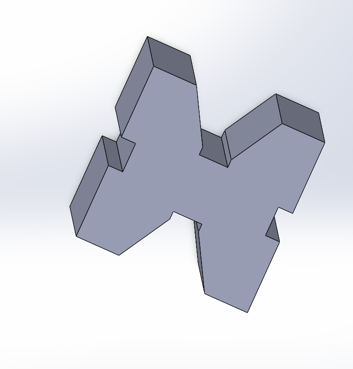
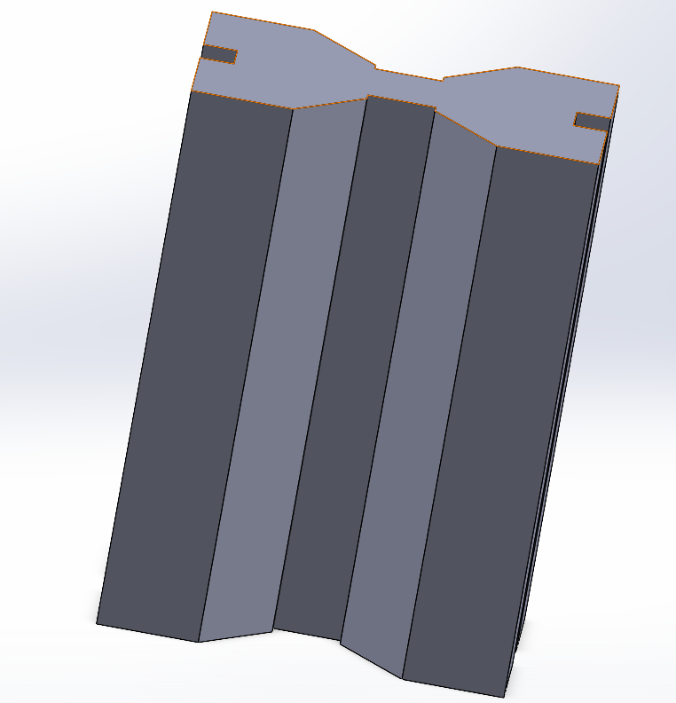
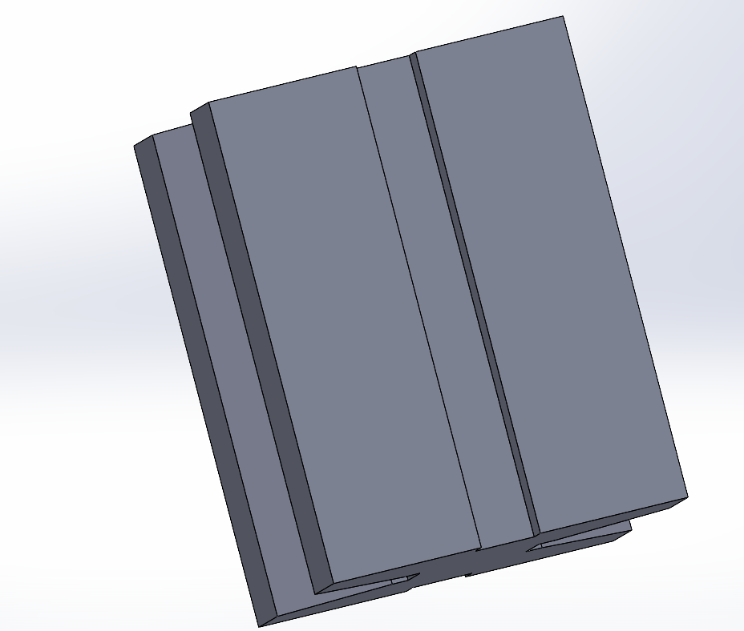

# HW 2 - Multi-View Homework Assignment

## 📋 Project Overview
Second homework assignment featuring comprehensive multi-view documentation, demonstrating advanced visualization and documentation skills.

## 🖼️ Multi-View Previews

### View 1: Primary Design Perspective


### View 2: Alternative Angle


### View 3: Detail/Cross-Section View


## � **Quick Access & Download**

<div align="center">

### 📥 **Download SOLIDWORKS File**
[](HW%202.SLDPRT)

**Direct File Access:** [🔧 `HW 2.SLDPRT`](HW%202.SLDPRT)

---

### 🎯 **Quick Navigation**
| 📁 **File Type** | 📂 **File Name** | 🔗 **Quick Access** |
|:---:|:---:|:---:|
| 🔧 **SOLIDWORKS** | `HW 2.SLDPRT` | [📥 **Download**](HW%202.SLDPRT) |
| 🖼️ **Preview 1** | `2.1.png` | [🖼️ **View**](2.1.png) |
| 🖼️ **Preview 2** | `2.2.png` | [🖼️ **View**](2.2.png) |
| 🖼️ **Preview 3** | `2.3.png` | [🖼️ **View**](2.3.png) |

</div>

## �📂 File Contents

### 🔧 SOLIDWORKS Files
- **`HW 2.SLDPRT`** - Main SOLIDWORKS part file with advanced modeling features
  - 📥 **[Direct Download Link](HW%202.SLDPRT)**

### 📸 Comprehensive Visual Documentation
- **`2.1.png`** - Primary design view showing main features
- **`2.2.png`** - Alternative perspective highlighting design details  
- **`2.3.png`** - Specialized view (cross-section/detail/exploded)

## 🎯 Assignment Details
- **Assignment:** HW 2 (Multi-View Documentation)
- **Type:** Advanced Independent Homework
- **Status:** Completed ✅
- **Focus:** Advanced modeling with comprehensive visualization

## 📋 File Structure
```
HW 2/
├── HW 2.SLDPRT    # Advanced SOLIDWORKS part file
├── 2.1.png        # Primary view documentation
├── 2.2.png        # Alternative angle documentation  
├── 2.3.png        # Detail/specialized view
└── README.md      # This comprehensive documentation
```

## 🔍 Advanced Features
- **Multi-View Documentation:** Three distinct perspectives of the design
- **Complex Geometry:** Advanced modeling techniques demonstrated
- **Professional Presentation:** Industry-standard documentation approach

## 📝 Documentation Excellence
- **View 1:** Showcases primary design features and overall geometry
- **View 2:** Provides alternative perspective for complete understanding
- **View 3:** Offers detailed or specialized view (cross-section/exploded/close-up)

## 🚀 Advanced Skills Demonstrated
- Complex 3D modeling capabilities
- Multi-angle visualization techniques
- Professional documentation standards
- Advanced feature creation and modification
- Comprehensive design communication

## 📊 Enhanced Assessment Criteria
- **Technical Complexity:** Advanced modeling techniques applied
- **Visual Communication:** Clear, comprehensive multi-view presentation
- **Professional Standards:** Industry-level documentation quality
- **Design Innovation:** Creative problem-solving approaches

## 🎓 Progressive Learning Value
This assignment builds significantly on HW 1, introducing advanced documentation practices essential for professional SOLIDWORKS work.

## 🔗 Related Assignments
- **Previous:** [HW 1](../HW%201/) - Foundation skills
- **Next:** [HW 3](../HW%203/) - Advanced techniques with 3D export

---
*Advanced homework demonstrating multi-view documentation mastery*
