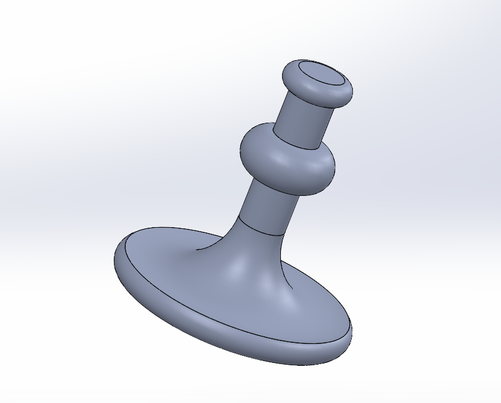

# HW Day 3 - Homework 2## 🚀 **Quick Access & Download**

<div align="center">

### 📥 **Download SOLIDWORKS File**
[](hw%20day%203%2C%2002.SLDPRT)

**Direct File Access:** [🔧 `hw day 3, 02.SLDPRT`](hw%20day%203%2C%2002.SLDPRT)

---

### 🎯 **Quick Navigation**
| 📁 **File Type** | 📂 **File Name** | 🔗 **Quick Access** |
|:---:|:---:|:---:|
| 🔧 **SOLIDWORKS** | `hw day 3, 02.SLDPRT` | [📥 **Download**](hw%20day%203%2C%2002.SLDPRT) |
| 📸 **Progress** | `Screenshot 2025-09-30 152531.png` | [🖼️ **View**](Screenshot%202025-09-30%20152531.png) |
| 📷 **Additional** | `image.png` | [🖼️ **View**](image.png) |
| 📚 **Reference** | `WhatsApp Image...72839ba7.jpg` | [🔍 **View**](WhatsApp%20Image%202025-09-27%20at%2012.23.38_72839ba7.jpg) |

</div>

## 📂 File Contents

### 🔧 SOLIDWORKS Files
- **`hw day 3, 02.SLDPRT`** - Main SOLIDWORKS part file for homework assignment 2
  - 📥 **[Direct Download Link](hw%20day%203%2C%2002.SLDPRT)**# 📋 Project Overview
This folder contains the second homework assignment from Day 3, featuring SOLIDWORKS modeling work with comprehensive documentation.

## �️ Interactive Design Gallery

### 🎯 Design Progress Screenshot

*Progress screenshot showing the homework development process*

### 📷 Additional Project Documentation

*Additional project image providing supplementary design information*

### 📚 Reference Material
<details>
<summary>🔍 Click to view reference image</summary>


*Reference image provided for design guidance and specifications*

</details>

## �📂 File Contents

### 🔧 SOLIDWORKS Files
- **`hw day 3, 02.SLDPRT`** - Main SOLIDWORKS part file for homework assignment 2

### 📸 Screenshots & Images
- **`Screenshot 2025-09-30 152531.png`** - Design progress screenshot
- **`image.png`** - Additional project image
- **`WhatsApp Image 2025-09-27 at 12.23.38_72839ba7.jpg`** - Reference material

## 🎯 Assignment Details
- **Date Created:** September 27-30, 2025
- **Type:** Homework Assignment
- **Day:** Day 3
- **Assignment:** HW 2
- **Status:** Completed ✅

## 📋 File Structure
```
hw 2/
├── hw day 3, 02.SLDPRT                   # Main SOLIDWORKS file
├── Screenshot 2025-09-30 152531.png         # Progress screenshot
├── image.png                                 # Additional image
├── WhatsApp Image 2025-09-27...72839ba7.jpg # Reference image
└── README.md                                 # This file
```

## 🔍 Design Preview
The screenshots and images document the design process and final result for the second homework assignment of Day 3.

## 📝 Assignment Highlights
- **Focus:** Advanced SOLIDWORKS modeling techniques
- **Challenge Level:** Intermediate
- **Key Skills:** [Based on Day 3 curriculum]
- **Documentation:** Multiple images showing design progression

## 🎓 Technical Details
- **Software:** SOLIDWORKS
- **File Format:** .SLDPRT (Part File)
- **Creation Period:** September 27-30, 2025
- **Reference Materials:** Provided via WhatsApp communication

## 🚀 Skills Demonstrated
- Independent problem-solving in SOLIDWORKS
- Application of Day 3 concepts to homework scenarios
- Comprehensive project documentation
- Design iteration and refinement

---
*Assignment completed on: September 30, 2025*