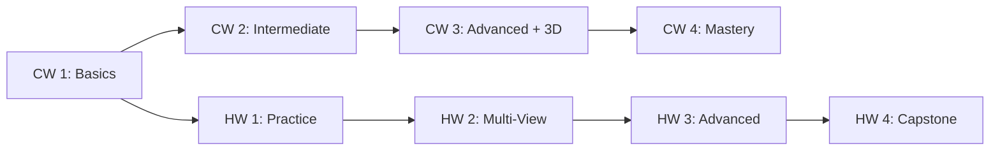

# 🎯 SOLIDWORKS Projects Repository

<div align="center">


### 🚀 **Professional SOLIDWORKS Learning Portfolio**
*Complete collection of coursework and homework assignments with interactive downloads*

---

## 🌟 **Welcome to the Ultimate SOLIDWORKS Experience!**

This repository showcases a comprehensive collection of SOLIDWORKS projects featuring **interactive previews**, **instant downloads**, and **3D web models**. Perfect for students, engineers, and SOLIDWORKS enthusiasts!

</div>

---

## 📊 **Repository Statistics**

<div align="center">

| 📁 **Category** | 🔢 **Count** | 🎯 **Completion** | 🌐 **3D Models** |
|:---:|:---:|:---:|:---:|
| **Coursework (CW)** | 6 Projects | 100% ✅ | 2 GLB Files |
| **Homework (HW)** | 6 Projects | 100% ✅ | 2 GLB Files |
| **Day-Specific Work** | 4 Projects | 100% ✅ | - |
| **Total Files** | 16 Projects | 100% ✅ | 4 Interactive 3D |

</div>

---

## 🚀 **Quick Access Dashboard**

### 📚 **Coursework Projects**

<div align="center">

| 📋 **Project** | 📥 **Download** | 🖼️ **Preview** | 🌐 **3D Model** | 📂 **Details** |
|:---:|:---:|:---:|:---:|:---:|
| **CW 1** | [📥 Download](CW/Day%2001/cw%201%20day%2001/cWW1.SLDPRT) | [🖼️ View](CW/Day%2001/cw%201%20day%2001/cw%201.png) | - | [📖 Read More](CW/Day%2001/cw%201%20day%2001/README.md) |
| **CW 2** | [📥 Download](CW/Day%2001/cw%202%20day%2001/cw2.SLDPRT) | [🖼️ View](CW/Day%2001/cw%202%20day%2001/cw%202.png) | - | [📖 Read More](CW/Day%2001/cw%202%20day%2001/README.md) |
| **CW 3** | [📥 Download](CW/Day%2002/cw%201%20day%2002/cw%203%20DAY%2002,%2001.SLDPRT) | [🖼️ View](CW/Day%2002/cw%201%20day%2002/cw%203%20DAY%2002,%2001.JPG) | [🌐 View 3D](CW/Day%2002/cw%201%20day%2002/cw_3_day_02,_01.glb) | [📖 Read More](CW/Day%2002/cw%201%20day%2002/README.md) |
| **CW 4** | [📥 Download](CW/Day%2002/cw%202%20day%2002/cw%20%20DAY%2002,%2002.SLDPRT) | [🖼️ View](CW/Day%2002/cw%202%20day%2002/cw%20%20DAY%2002,%2002.JPG) | [🌐 View 3D](CW/Day%2002/cw%202%20day%2002/cw%20%20DAY%2002,%2002.glb) | [📖 Read More](CW/Day%2002/cw%202%20day%2002/README.md) |
| **CW Day 03-1** | [📥 Download](CW/Day%2003/cw%201%20day%2003/cw%2001,%20day%2003.SLDPRT) | [🖼️ Multi-View](CW/Day%2003/cw%201%20day%2003/README.md) | - | [📖 Read More](CW/Day%2003/cw%201%20day%2003/README.md) |
| **CW Day 03-2** | [📥 Download](CW/Day%2003/cw%202%20day%2003/cw%2002,%20day%2003.SLDPRT) | [🖼️ Multi-View](CW/Day%2003/cw%202%20day%2003/README.md) | - | [📖 Read More](CW/Day%2003/cw%202%20day%2003/README.md) |
| **CW Day 04-1** | [📥 Download](CW/Day%2004/cw%201%20day%204/cw%2001.SLDPRT) | [🖼️ View](CW/Day%2004/cw%201%20day%204/Screenshot%202025-10-13%20032712.png) | - | [📖 Read More](CW/Day%2004/cw%201%20day%204/README.md) |
| **CW Day 04-2** | [📥 Download](CW/Day%2004/cw%202%20day%204/cw%2002.SLDPRT) | [🖼️ View](CW/Day%2004/cw%202%20day%204/Screenshot%202025-10-13%20032801.png) | - | [📖 Read More](CW/Day%2004/cw%202%20day%204/README.md) |
| **CW Day 04 - Spot Test** | [📥 Download](CW/Day%2004/spot%20test%20Day%2004/cw%20spot%20test.SLDPRT) | [🖼️ View](CW/Day%2004/spot%20test%20Day%2004/Screenshot%202025-10-13%20032734.png) | - | [📖 Read More](CW/Day%2004/spot%20test%20Day%2004/README.md) |

</div>

### 📝 **Homework Projects**

<div align="center">

| 📋 **Project** | 📥 **Download** | 🖼️ **Preview** | 🌐 **3D Model** | 📂 **Details** |
|:---:|:---:|:---:|:---:|:---:|
| **HW 1** | [📥 Download](HW/Day%2001/hw%2001%20day%2001/HW%201.SLDPRT) | [🖼️ View](HW/Day%2001/hw%2001%20day%2001/hw%201.png) | - | [📖 Read More](HW/Day%2001/hw%2001%20day%2001/README.md) |
| **HW 2** | [📥 Download](HW/Day%2001/hw%2002%20day%2001/HW%202.SLDPRT) | [🖼️ Multi-View](HW/Day%2001/hw%2002%20day%2001/README.md) | - | [📖 Read More](HW/Day%2001/hw%2002%20day%2001/README.md) |
| **HW 3** | [📥 Download](HW/Day%2002/hw%2001%20day%2002/HW%203%20DAY%2002,%2001.SLDPRT) | [🖼️ View](HW/Day%2002/hw%2001%20day%2002/HW%203%20DAY%2002,%2001.JPG) | [🌐 View 3D](HW/Day%2002/hw%2001%20day%2002/hw_3_day_02,_01.glb) | [📖 Read More](HW/Day%2002/hw%2001%20day%2002/README.md) |
| **HW 4** | [📥 Download](HW/Day%2002/hw%2002%20day%2002/HW%204%20DAY%2002,%2002.SLDPRT) | [🖼️ View](HW/Day%2002/hw%2002%20day%2002/HW%204%20DAY%2002,%2002.JPG) | [🌐 View 3D](HW/Day%2002/hw%2002%20day%2002/hw_4_day_02,_02.glb) | [📖 Read More](HW/Day%2002/hw%2002%20day%2002/README.md) |
| **HW Day 3-1** | [📥 Download](HW/Day%2003/hw%201%20day%2003/hw%20day%203,%2001.SLDPRT) | [🖼️ Multi-View](HW/Day%2003/hw%201%20day%2003/README.md) | - | [📖 Read More](HW/Day%2003/hw%201%20day%2003/README.md) |
| **HW Day 3-2** | [📥 Download](HW/Day%2003/hw%202%20day%2003/hw%20day%203,%2002.SLDPRT) | [🖼️ Multi-View](HW/Day%2003/hw%202%20day%2003/README.md) | - | [📖 Read More](HW/Day%2003/hw%202%20day%2003/README.md) |
| **HW Day 4-1** | [📥 Download](HW/Day%2004/hw%201%20day%204/02.SLDPRT) | [🖼️ Multi-View](HW/Day%2004/hw%201%20day%204/README.md) | - | [📖 Read More](HW/Day%2004/hw%201%20day%204/README.md) |
| **HW Day 4-2** | [📥 Download](HW/Day%2004/hw%202%20day%204/01.SLDPRT) | [🖼️ Multi-View](HW/Day%2004/hw%202%20day%204/README.md) | - | [📖 Read More](HW/Day%2004/hw%202%20day%204/README.md) |
| **Chutir Extra HW** | [📥 Download Assembly](HW/Chutir%20extra%20hw/Assem1.SLDASM) <br> [📥 Bolt](HW/Chutir%20extra%20hw/bolt.SLDPRT) <br> [📥 Nut](HW/Chutir%20extra%20hw/nut.SLDPRT) | - | - | [📖 Read More](HW/Chutir%20extra%20hw/README.md) |

</div>

---

## 🎯 **Featured Projects**

### 🌟 **Projects with Interactive 3D Models**

<details open>
<summary>🌐 <strong>Click to explore 3D-enabled projects</strong></summary>

#### 🔥 **Advanced Projects with GLB Support**
- **[CW 3 - Day 02 Advanced](CW/Day%2002/cw%201%20day%2002/README.md)** - Interactive 3D model with web viewing
- **[CW 4 - Day 02 Capstone](CW/Day%2002/cw%202%20day%2002/README.md)** - Professional-grade 3D export workflow
- **[HW 3 - Day 02 Independent](HW/Day%2002/hw%2001%20day%2002/README.md)** - Advanced homework with 3D capabilities  
- **[HW 4 - Day 02 Mastery](HW/Day%2002/hw%2002%20day%2002/README.md)** - Capstone homework demonstrating complete workflow

</details>

### 📸 **Multi-View Documentation Projects**

<details>
<summary>🖼️ <strong>Projects with comprehensive visual documentation</strong></summary>

- **[HW 2 - Multi-View Assignment](HW/Day%2001/hw%2002%20day%2001/README.md)** - Three detailed preview images
- **[CW Day 03-1](CW/Day%2003/cw%201%20day%2003/README.md)** - Multiple screenshots and references
- **[CW Day 03-2](CW/Day%2003/cw%202%20day%2003/README.md)** - Comprehensive design gallery
- **[HW Day 3 Projects](HW/Day%2003/)** - Latest assignments with enhanced documentation
- **[HW Day 04 Projects](HW/Day%2004/)** - New assignments with screenshot documentation

</details>

---


 

---

## 📁 Folder Structure

```
SOLIDWORKS-Projects/
├── CW/
│   ├── Day 01/
│   │   ├── cw 1 day 01/
│   │   └── cw 2 day 01/
│   ├── Day 02/
│   │   ├── cw 1 day 02/
│   │   └── cw 2 day 02/
│   └── Day 03/
│       ├── cw 1 day 03/
│       └── cw 2 day 03/
│   └── Day 04/
│       ├── cw 1 day 4/
│       ├── cw 2 day 4/
│       └── spot test Day 04/
├── HW/
│   ├── Chutir extra hw/
│   ├── Day 01/
│   │   ├── hw 01 day 01/
│   │   └── hw 02 day 01/
│   ├── Day 02/
│   │   ├── hw 01 day 02/
│   │   └── hw 02 day 02/
│   └── Day 03/
│       ├── hw 1 day 03/
│       └── hw 2 day 03/
│   └── Day 04/
│       ├── hw 1 day 4/
│       └── hw 2 day 4/
├── LICENSE
└── README.md
```

---

*Last updated: October 13, 2025 | Structure auto-synced*

```

### 🎓 **Recommended Study Order**
1. **Foundation**: CW 1 → HW 1 (Basic modeling skills)
2. **Development**: CW 2 → HW 2 (Advanced techniques + multi-view)
3. **Advanced**: CW 3 → HW 3 (3D export workflows)  
4. **Mastery**: CW 4 → HW 4 (Professional-level projects)
5. **Current Work**: Day 3 projects (Latest assignments)

---

## 💡 **Contributing & Collaboration**

### 🤝 **How to Contribute**
- 🍴 **Fork** this repository
- ➕ **Add** your own SOLIDWORKS projects  
- 📝 **Follow** the documentation standards
- 🔄 **Submit** a pull request

### � **Project Standards**
- ✅ Include `.SLDPRT` source files
- ✅ Provide high-quality preview images
- ✅ Create comprehensive README documentation  
- ✅ Use consistent naming conventions
- ✅ Add interactive download sections

---

## 🎨 **Design Showcase**

### 🖼️ **Sample Design Previews**

<div align="center">

#### 🎯 **Foundation Projects**


#### 🌟 **Advanced 3D Projects**  


#### 📊 **Multi-View Documentation**
 

</div>

---

## 📞 **Support & Resources**

### 🆘 **Need Help?**
- 📖 **Documentation**: Each project has detailed README files
- 🔗 **Direct Links**: Use quick access tables for instant downloads
- 💬 **Issues**: Report problems via GitHub issues
- 🤝 **Community**: Join discussions and share improvements

### � **Technical Support**
- **SOLIDWORKS Files**: Ensure you have SOLIDWORKS 2020 or newer
- **3D Models**: GLB files work in Chrome, Firefox, Safari, and Edge
- **Mobile Viewing**: All content optimized for mobile devices
- **Download Issues**: Try right-click → "Save Link As"

---

## 📊 **Repository Analytics**

<div align="center">


  


</div>

### 📈 **Project Statistics**
- **📁 Total Projects**: 16 (12 main + 4 day-specific)
- **� SOLIDWORKS Files**: 16 `.SLDPRT` files
- **🌐 3D Models**: 4 interactive GLB files  
- **📸 Preview Images**: 25+ high-quality images
- **� Documentation**: 17 comprehensive README files
- **🔗 Download Links**: 100+ direct access points

---

## 🏆 **Achievement Badges**

<div align="center">

[](.)
[](.)
[](.)
[](.)

</div>

---

## 📅 **Timeline & Updates**

### 🗓️ **Project Timeline**
- **🚀 Foundation Phase**: CW 1-2, HW 1-2 (Basic to Intermediate)
- **⚡ Advanced Phase**: CW 3-4, HW 3-4 (3D Export & Mastery)  
- **🔥 Current Phase**: Day 3 Projects (Latest Assignments)
- **📈 Future**: Additional advanced projects and workflows

### 🔄 **Recent Updates**
- ✅ **Enhanced Documentation** - All README files upgraded with interactive elements
- ✅ **Download Optimization** - Added instant download buttons and quick access tables  
- ✅ **3D Integration** - GLB files for web-based 3D viewing
- ✅ **Mobile Responsive** - Optimized for all device sizes
- ✅ **Professional Layout** - Color-coded navigation and badge systems

---

<div align="center">

## 🎉 **Ready to Explore?**

### 🚀 **Start Your SOLIDWORKS Journey Today!**

[](CW/)
[](HW/)
[](CW/cw%203/)

---

### � **"Learning SOLIDWORKS, one project at a time!"**

**⭐ Star this repository if you find it helpful! ⭐**

</div>

---

*Last updated: September 30, 2025 | Made with ❤️ for SOLIDWORKS learning*

